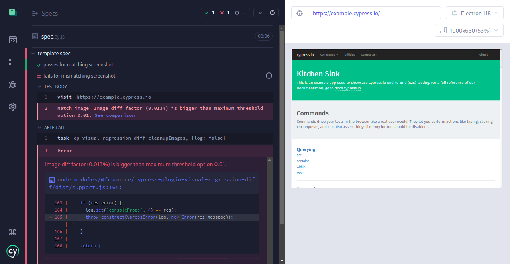
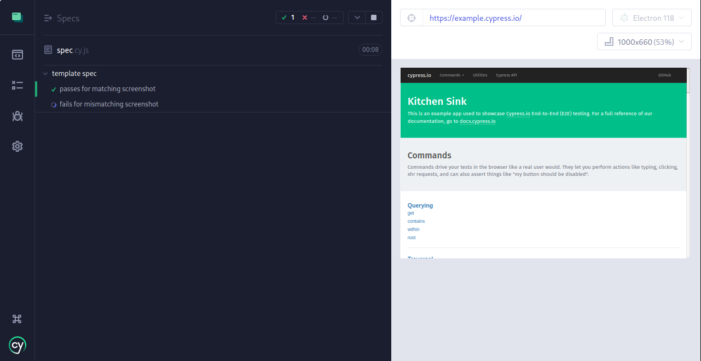

# cypress-visual-testing-error-demo

This small demo illustrates a problem with the [@frsource/cypress-plugin-visual-regression-diff](https://github.com/FRSOURCE/cypress-plugin-visual-regression-diff) plugin together with Cypress 13.7.3.

-> https://github.com/cypress-io/cypress/issues/29350

## Steps to reproduce

```
npm ci
npx cypress open
```
-> run E2E tests in electron - one succeeds, one fails.



Then upgrade to Cypress 13.7.3:
```
npm install cypress@13.7.3
npx cypress open
```
-> run E2E tests in electron - one succeeds, the other one gets stuck indefinitely.


